# Hi there 👋, I am Victoire BAKE

## A pationnate _Web developer_ based In Goma (DR Congo)

I enjoy developing web applications with accessibility, [performance and automated tests](https://github.com/vickbk/multi-step-form) in mind. Got a real passion for creating inclusive solutions with modern tools.

I love tackling [complex problems](https://www.frontendmentor.io/profile/vickbk?tab=solutions), [learning new skills](https://roadmap.sh/u/vickbk), and collaborating with diverse teams to create innovative solutions.

I like [sharing my knowledge](https://www.frontendmentor.io/profile/vickbk?tab=code-reviews) to empower others and to build a more inclusive future.

- 🔭 I’m currently working on my online profile
- 🌱 I’m continously learning accessibility and best practices as well as enhacing my development skills on [FrontendMentor](https://www.frontendmentor.io) and [roadmap.sh](https://roadmap.sh)
- 👯 I’m looking to join a developement team that takes consideration of accessibility and good practices
- 💬 Ask me about anything regarding web development or accessibility best practices.
- ⚡ Fun fact: I prefere shortening my name (Other names too 🤓). Hence VickBK!

### Connect with me:

### Languages and Tools:

                  

<!--
**vickbk/vickbk** is a ✨ _special_ ✨ repository because its `README.md` (this file) appears on your GitHub profile.

Here are some ideas to get you started:

- 🔭 I’m currently working on ...
- 🤔 I’m looking for help with ...
- 📫 How to reach me: ...
- 😄 Pronouns: ...
- ⚡ Fun fact: ...
  -->
